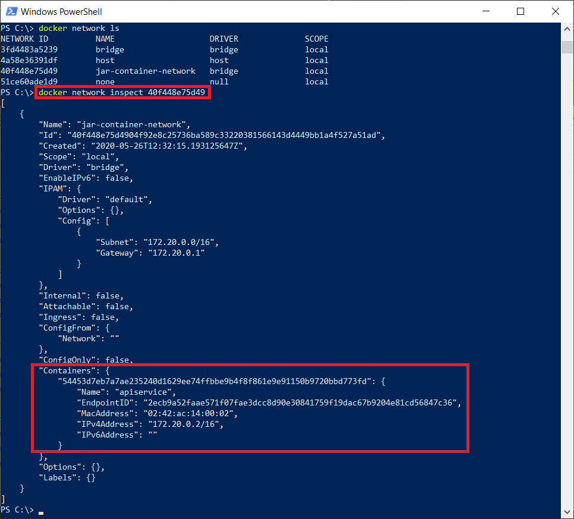

# Container Communication for ASP.NET Core Web Api REST Microservices

Here we deploy 2 ASP.NET Core Web Api microservices applications, named ClientService & ApiService, inside 2 different local Docker containers. Then ClientService will call ApiService to get its data.

## Configure Target Service (ApiService)

Service with name "ApiService" is providing data, so it will be the target service.

Below code shows the exposed API(Weather) of ApiService, which is returning an Array of type WeatherForecast.

```csharp
    [ApiController]
    [Route("api/[controller]/[action]")]
    public class WeatherForecastController : ControllerBase
    {
        private static readonly string[] Summaries = new[]
        {
            "Freezing", "Bracing", "Chilly", "Cool", "Mild", "Warm", "Balmy", "Hot", "Sweltering", "Scorching"
        };

        private readonly ILogger<WeatherForecastController> _logger;

        public WeatherForecastController(ILogger<WeatherForecastController> logger)
        {
            _logger = logger;
        }

        [HttpGet]
        public IEnumerable<WeatherForecast> Weather()
        {
            var rng = new Random();
            return Enumerable.Range(1, 5).Select(index => new WeatherForecast
            {
                Date = DateTime.Now.AddDays(index),
                TemperatureC = rng.Next(-20, 55),
                Summary = Summaries[rng.Next(Summaries.Length)]
            })
            .ToArray();
        }
    }
```

## Configure IP communication across different Containers

When you deploy services across different containers, the basic container level communication is using IP.

If you run ApiService selecting "Docker" as host locally:

<p>
  
</p>

you should see an output like below:

<p>
  
</p>

You must understand that this web page has been launched from a Docker container, and so this local service (ApiService), with its API, has been hosted in a local Docker container. We need to find that container IP for any communication with this specific API. We can't use the browser address displaying here for internal service communication, if using containers.

When ApiService is running we need to find the IP address of the container that ApiService is running on. We can't use the URL displayed in the above browser picture for internal service communication, if using containers. So we should run below docker commands to get the container IP.

 Run

```bash
docker ps
```

 to see all local docker containers running and from there identify "ApiService" container to get it's container id. You might noticed that, "b36368ca995e" is the container id of ApiService.

 Run

 ```bash
docker inspect -f "{{range .NetworkSettings.Networks}}{{.IPAddress}}{{end}}" b36368ca995e
```

to see the IP of the ApiService container. Usually `docker inspect` command will return load of information, but we are interested only in IP. That filter has been mentioned with a paramter "-f"

<p>
  
</p>

Now, this IP should be used in the ClientService in order to call ApiService from its own container.

## Configure Source Service (ClientService)

Service with name "ClientService" is pulling data from ApiService.

Below code shows the client source service calling a method `CallApiService()`, which internally calls to target service i.e. ApiService. The line `BaseAddress = new Uri(baseApiServiceAddress)` is the key, where we used the container IP of the ApiService for the communication. Remaining sections of code are all like a normal HttpClient call.

```csharp
    [ApiController]
    [Route("[controller]")]
    public class WeatherForecastController : ControllerBase
    {

        private readonly IConfiguration _configuration;
        private readonly ILogger<WeatherForecastController> _logger;

        public WeatherForecastController(IConfiguration configuration, ILogger<WeatherForecastController> logger)
        {
            _logger = logger;
            _configuration = configuration;
        }

        [HttpGet]
        public IEnumerable<WeatherForecast> Get()
        {
            return CallApiService().ToArray();
        }
        private IEnumerable<WeatherForecast> CallApiService()
        {
            IEnumerable<WeatherForecast> weatherData = new List<WeatherForecast>();
            try
            {
                var baseApiServiceAddress = _configuration["ApiServiceBaseAddress"];

                using var client = new HttpClient
                {
                    BaseAddress = new Uri(baseApiServiceAddress)
                };

                client.DefaultRequestHeaders.Accept.Clear();
                client.DefaultRequestHeaders.Accept.Add(new MediaTypeWithQualityHeaderValue("application/json"));
                var response = client.GetAsync("api/weatherforecast/weather").Result;
                if (response.IsSuccessStatusCode)
                {
                    var jsonTask = response.Content.ReadAsAsync<IEnumerable<WeatherForecast>>();
                    jsonTask.Wait();
                    weatherData = jsonTask.Result;
                }
            }
            catch (Exception ex)
            {
                Console.WriteLine(ex.Message);
            }
            return weatherData;
        }
    }
```

The `ApiServiceBaseAddress` configuration parameter is defined in the `appsettings.json` file with the value of the IP of the ApiService container:

```json
{
  "Logging": {
    "LogLevel": {
      "Default": "Information",
      "Microsoft": "Warning",
      "Microsoft.Hosting.Lifetime": "Information"
    }
  },
  "ApiServiceBaseAddress": "http://172.20.0.2/",
  "AllowedHosts": "*"
}
```

Now you can run ClientService and see below debug point to understand the runtime execution and values returning from ApiService.

<p>
  
</p>

But at his point, we can't depend on IP for internal container communication. In real world, using IP to communicate across containers may not be a proper choice and it would be better to have a DNS and connect to the containers using that DNS.

## Creating Our Own Docker Network Bridge

When we run a container it isn't directly connected to the network adapter of the host machine, but to a Bridge inside Docker. Multiple containers can be connected to the same Bridge. DNS option is enabled by default, since automatically the Bridge DNS gets an entry for each container, using the name which has been assigned by Docker. The default Docker Bridge doesn't support this feature and we'll need to create our own Network Bridge to achieve this goal.

In order to create our own network bridge, we can run the command:

```bash
docker network create jar-container-network
```

We can confirm it has been created by running:

```bash
docker network ls
```

<p>
  
</p>

Now we need to enable container orchestration inside the VS 2019 projects.

## Enable Container Orchestration

We need to right click on project in Visual Studio 2019 and choose below options.

<p>
  
</p>

<p>
  
</p>

We need to do this with both service projects and then we will get a separate project like below. Please notice `docker-compose.yml` in it, where we will mention that the containers should use above created "jar-container-network" as docker network.

<p>
  
</p>

Now we need to modify `docker-compose.yml` content for both service projects as below.

**ApiService docker-compose.yml**

```yaml
version: '3.4'

services:
  apiservice:
    image: ${DOCKER_REGISTRY-}apiservice
    container_name: apiservice

    build:
      context: .
      dockerfile: ApiService/Dockerfile
networks:  
    default:  
        external:  
            name:  jar-container-network
```

**ClientService docker-compose.yml**

```yaml
version: '3.4'

services:
  clientservice:
    image: ${DOCKER_REGISTRY-}clientservice
    container_name: clientservice
    build:
      context: .
      dockerfile: ClientService/Dockerfile
networks:  
    default:  
        external:  
            name:  jar-container-network
```

Notice that we mentioned single custom network bridge for both services.

## Run Source (ApiService) & Target (ClientService) Services

Now we can run our source service (ApiService), selecting "Docker Compose" as host locally, and make sure that it's using our new custom Network Bridge.

<p>
  
</p>

Once ApiService has been started running locally using Visual Studio 2019, run docker the command:

```bash
docker network inspect 40f448e75d49
```

to inspect the docker network and make sure that ApiService has been connected to our new custom Network Bridge. The last parameter is the network id of our new custom Network Bridge, which will get by running `docker network ls`. We can see in the following diagram that in the Containers section, ApiService is now displayed.

<p>
  
</p>

## Remove IP Ref. in ClientService

Now we can change the IP of the ApiService container used to access it from inside ClientService container, because right now both containers are bound to a common custom Network Bridge. So we can just replace that IP Ref. with the ApiService DNS name in the ClientService `appsettings.json` configuration file as shown below:

```json
{
  "Logging": {
    "LogLevel": {
      "Default": "Information",
      "Microsoft": "Warning",
      "Microsoft.Hosting.Lifetime": "Information"
    }
  },
  "ApiServiceBaseAddress": "http://apiservice/",
  "AllowedHosts": "*"
}
```

Once the configuration parameter is updated, we can run this modified ClientService through Visual Studio 2019 and make sure that both services share the same custom Network bridge by running again `docker network inspect 40f448e75d49`. This time you will notice additional ClientService as well in the Containers section.

<p>
  
</p>

We got the expected response from ApiService container, without using its container IP, but using instead it's DNS name.

<p>
  
</p>

During Microservices deployment, we need to consider internal communication across different services. We don't need to hit our API gateway just for internal service communication. Using DNS as a way to communication across service containers is supported by multiple orchestration PaaS vendors including Azure Kubernetes Services.
